# Time to Digital Converter (TDC) Design

## Motivation

In high performance computing systems, one of the most essential circuit blocks is the Phase Locked Loop (PLL). PLL's are used to synchronize periodic signals and they are critical in various applications such as clock recovery, clock generation, and clock distribution. One type of PLL is the All Digital PLL or ADPLL.

ADPLL's are extensively used in digital circuits to enable maximum performance. They are used in high speed serial links, processors, and other digital systems. The ADPLL can enable other techniques such as Multiphase Clock Generation which allows us to operate our systems at much higher frequencies. 

## ADPLL Overview

The ADPLL is a complex system that can be broken down into a few smaller sub circuits. The ADPLL is at its core, a feedback system. There are three major tasks performed by the ADPLL:

1. Frequency Detection
2. Control Signal Generation
3. Clock Generation

In the first step, a Time to Digital Converter measures the continuous time difference between a reference clock and the clock generated by the digitally controlled oscillator.

The TDC outputs a digital signal (usually a thermometer code) which is then processed by another sub circuit to be converted into a control signal suitable for the digitally controlled oscillator.

Finally, the digitally controlled oscillator gets adjusted by this control signal and the loop repeats until the system is stable.

## TDC Design

Designing an entire ADPLL is a large undertaking. For the purposes of this final project, the scope of the design task will be restricted to only the Time to Digital Converter that could be deployed in the ADPLL. The TDC will be designed to measure the time difference between two input pulses (a start signal and a stop signal) and output a thermometer code that corresponds to this time difference.

To accomplish this we need two tools. First, we need a way to determine which of two input pulses occurred first. We can implement this using a D-Flip-Flop. We also need a way to consistently delay an input pulse. We can implement this functionality with a buffer.

With these two tools (Pulse Arbiter and Delay Unit) we can successively slow down our start signal using our delay units until it eventually occurs after our stop signal. With a chain of delay units and a chain of arbiters to compare our delayed start signal to our stop signal, we can output a string of bits that will accumulate 1's until the stop signal catches up to the delayed start signal at which point our output string will switch to all zeros.

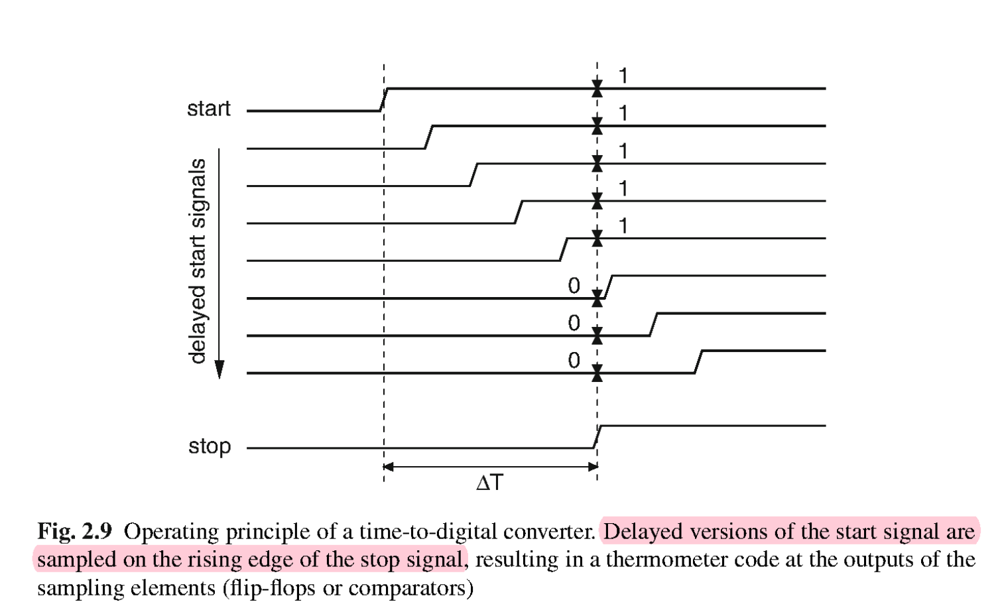

### Arbiter Simulation

The arbiter is implemented using a D-Flip-Flop. The Data line of the DFF is the delayed start signal. The clk port of the DFF is the stop signal. When the stop signal is toggled high, each arbiter will sample the state of the delayed start signal outputting a 1 if the start signal occurred first and a zero if the stop signal occurred first.

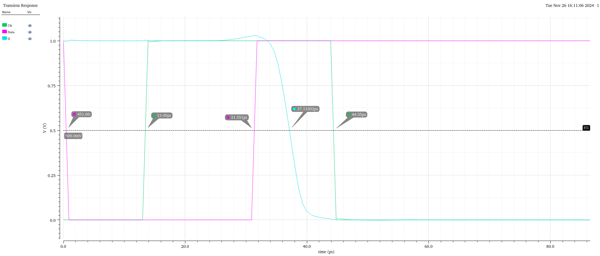

### Delay Unit and Delay Line Simulation

The delay unit is implemented using a high speed buffer. The speed of this buffer will determine the resolution of the entire TDC with the selected basic architecture.

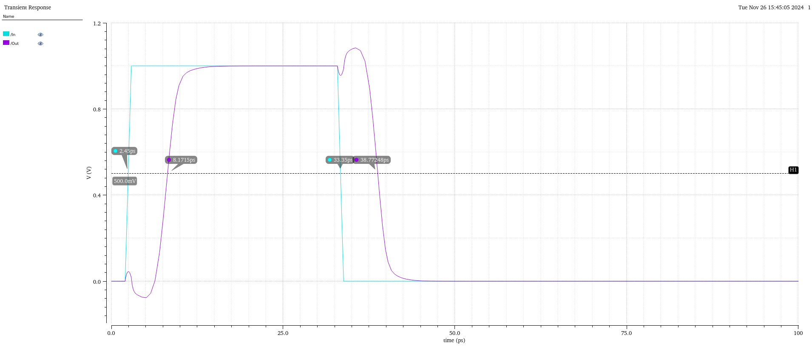

We observe that a single high speed buffer with no load connected to its output has a delay of roughly 6ps.

Once we connect eight buffers end to end in the delay line, the delay of each buffer slows a bit since our buffers are now loaded and have to drive the next buffer in the line.

**In the following plot, the 8u signal is mislabeled as 3u.**

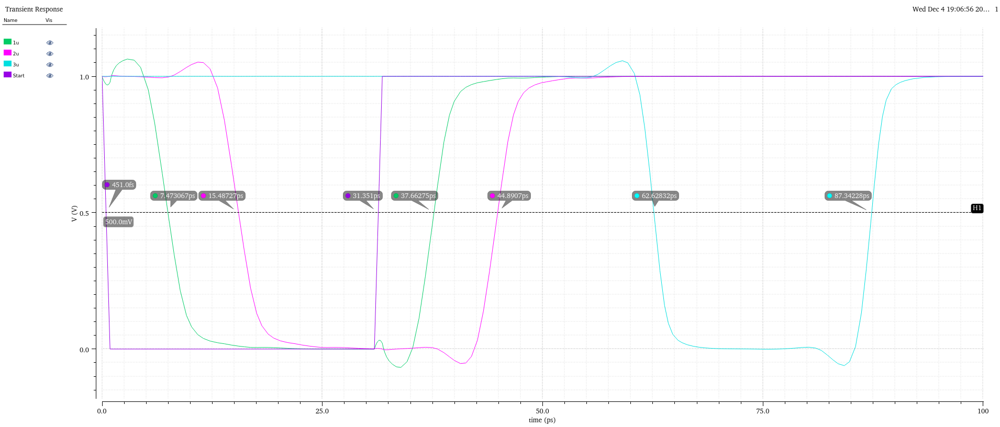

We observe that the new delay per buffer is roughly 8ps. We can also see that our delay is consistent since our signal switches at ~8ps after one unit of delay, ~16ps after 2 units of delay, and \~64ps after 8 units of delay.

### Top Level Schematic and Simulations

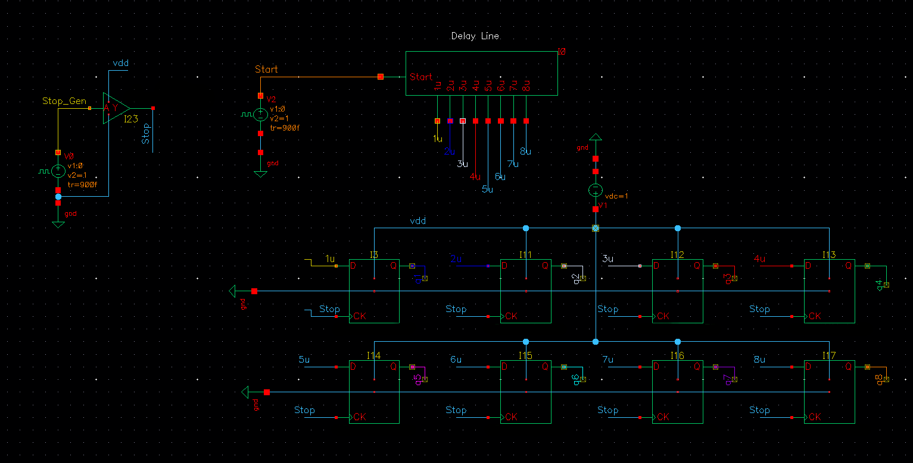

~3ps measurement:

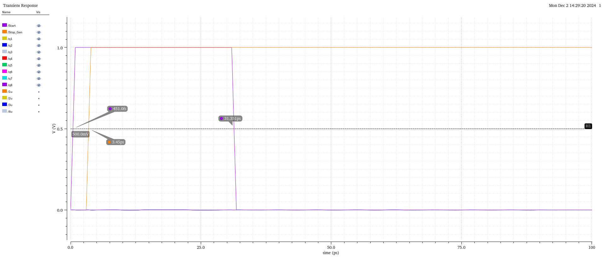

~9ps measurement:

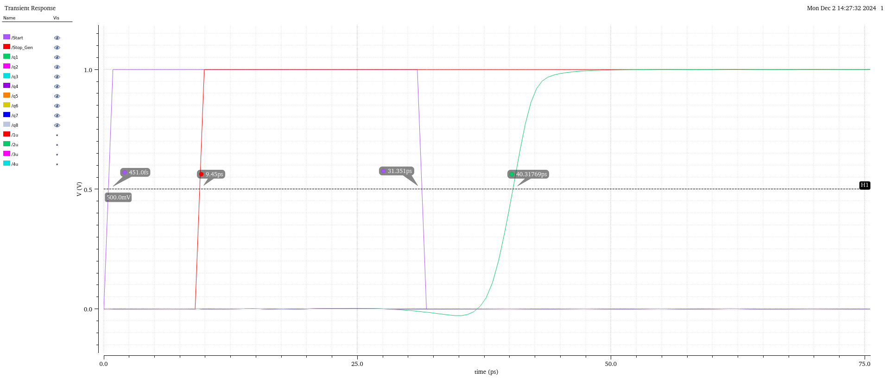

~18ps measurement:

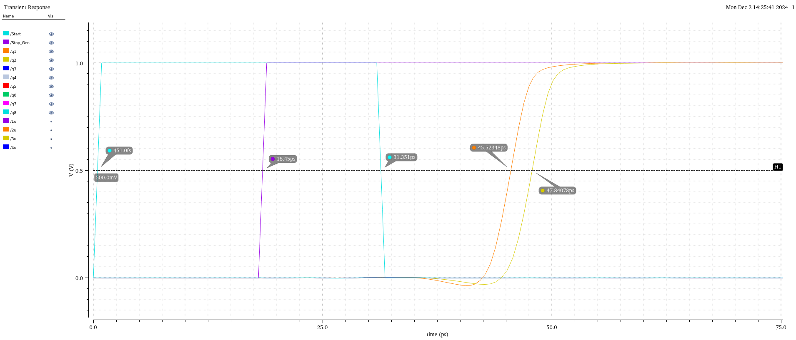

~30ps measurement:

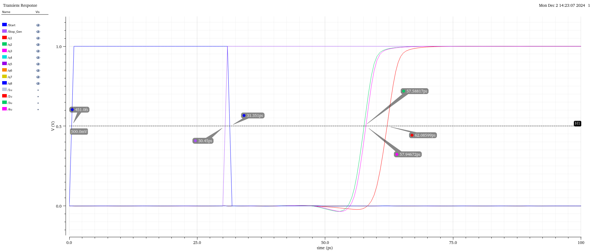

~68ps measurement:

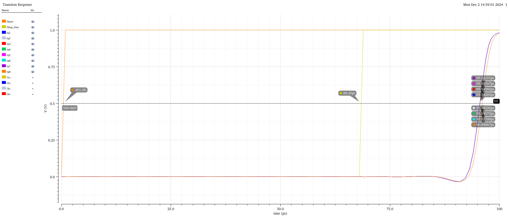

As we can see, our basic TDC implementation is able to successfully measure time differences at a resolution of 8ps with a time to measure of about 30ps in the worst case.

### Design Improvements

Our basic TDC implementation is successful, yet there are many improvements that could be made to address major limitations of the choice of such simple architecture.

Firstly, our TDC is only able to measure up time differences of up to 64ps. If we wish to measure any longer than this, we would need to expand our delay line consuming area on our chip.

Instead, we can implement a folded delay line with a loop counter.

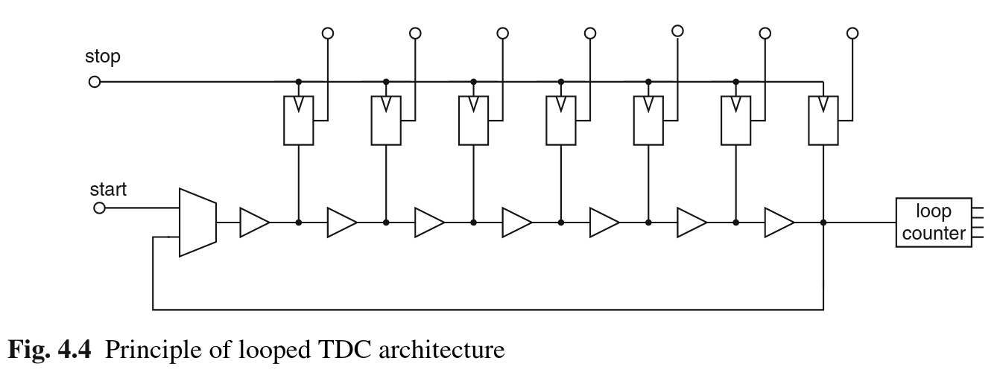

With this architecture, our start signal triggers what is now a ring oscillator and a loop counter determines how many oscillations occur. This allows us to expand our measurement range to a much larger value (total delay of delay line * maximum counter value).

Another improvement we could make is to increase the resolution beyond the minimum gate delay of our process. To do this, we can introduce a vernier delay line where we slow down both our start signal and our stop signal at the same time. Our new resolution is now limited by how closely we can tune the delay difference between two differently sized buffers.

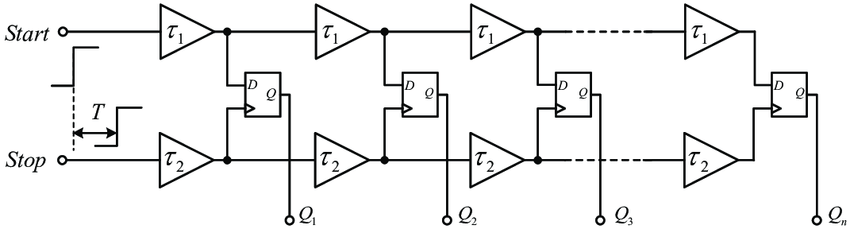

We can also further improve the vernier delay line by making a more combinations of comparisons in a 2D grid of arbiters.

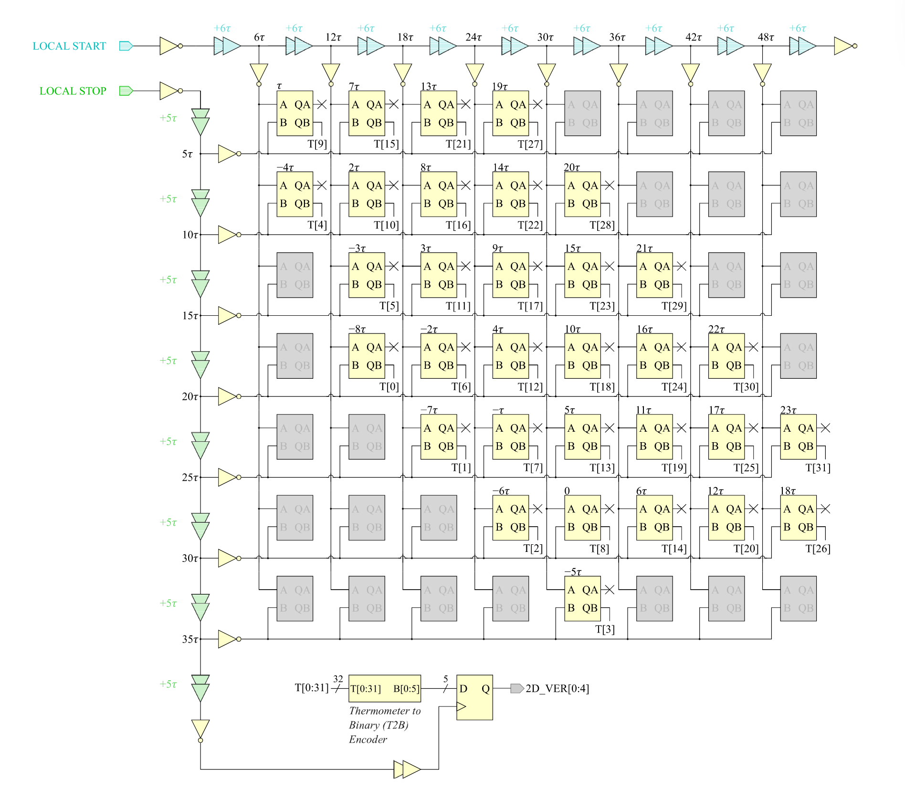

Finally, we can also achieve fine control over the tradeoffs of our TDC by implemented a hierarchical structure in which we make course measurements, then pass residual time differences off to other finer measurement circuits.

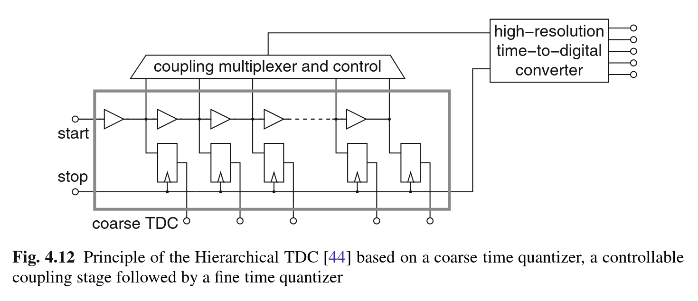
Further changes would also be necessary to ensure the manufacturability of this circuit in order to overcome PVT variations. For example, if our delay unit delay changes because of an environmental temperature change, our measurement interpretation will be incorrect. To account for this we can add a control mechanism to our delay units so that we can calibrate to our conditions and adjust the delay of the delay line.

## Conclusions

The Time to Digital Converter is an important circuit with wide ranging applications. Successful measurement of elapsed time can be achieved with quite simple circuitry, but to achieve high measurement accuracy across a wide measurement range while remaining robust to typical variations, we must employ more advanced architectures and introduce further design complexities that can mitigate these issues.

## Reference
[1] S. Henzler, “Time-to-digital converters,” Springer Series in Advanced Microelectronics, 2010. doi:10.1007/978-90-481-8628-0
