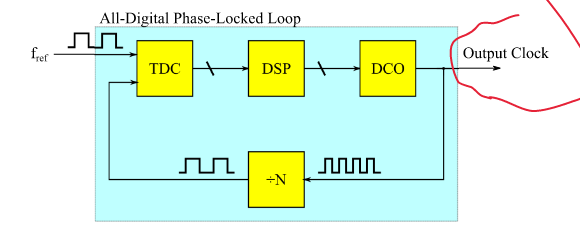

# Time to Digital Converter (TDC) Design

## Motivation

In high performance computing systems, one of the most essential circuit blocks is the Phase Locked Loop (PLL). PLL's are used to synchronize periodic signals
and they are critical in various applications such as clock recovery, clock generation, and clock distribution. One type of PLL is the All Digital PLL or ADPLL.

ADPLL's are extensively used in digital circuits to enable maximum performance. They are used in high speed serial links, processors, and other digital systems.
The ADPLL can enable other techniques such as Multiphase Clock Generation which allows us to operate our systems at much higher frequencies. 

## ADPLL Overview

The ADPLL is a complex system that can be broken down into a few smaller sub circuits. The ADPLL is at its core, a feedback system. There are three major tasks 
performed by the ADPLL:

1. Frequency Detection
2. Control Signal Generation
3. Clock Generation

In the first step, a Time to Digital Converter measures the continuous time difference between a reference clock and the clock generated by the digitally controlled
oscillator.

The TDC outputs a digital signal (usually a thermometer code) which is then processed by another sub circuit to be converted into a control signal suitable for the
digitally controlled oscillator.

Finally, the digitally controlled oscillator gets adjusted by this control signal and the loop repeats until the system is stable.

## TDC Design

Designing an entire ADPLL is a large undertaking. For the purposes of this final project, the scope of the design task will be restricted to only the Time to Digital
Converter that could be deployed in the ADPLL. The TDC will be designed to measure the time difference between two input pulses (a start signal and a stop signal) and output a thermometer code that corresponds to this time difference.

To accomplish this we need two tools. First, we need a way to determine which of two input pulses occurred first. We can implement this using a D-Flip-Flop. We also
need a way to consistently delay an input pulse. We can implement this functionality with a buffer.

With these two tools (Pulse Arbiter and Delay Unit) we can successively slow down our start signal using our delay units until it eventually occurs after our stop signal.
With a chain of delay units and a chain of arbiters to compare our delayed start signal to our stop signal, we can output a string of bits that will accumulate 1's until the stop
signal catches up to the delayed start signal at which point our output string will switch to all zeros.

