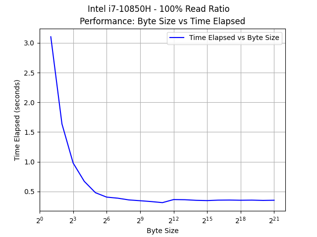
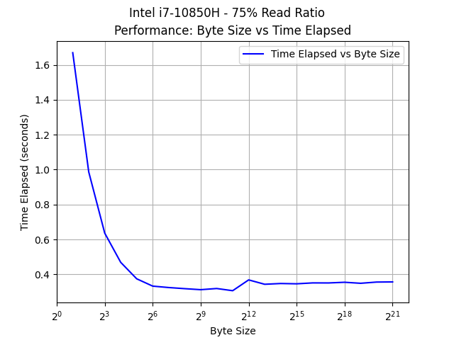
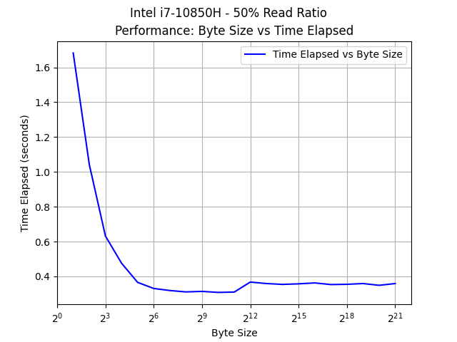

# Advanced Computer Systems - Project 1
## Results

### Experiment 1: Memory Latency
1. The latency of the main memory is **78.6	ns** as found by Intel's Memory Latency Checker using the --idle_latency test.

### Experiment 2: Memory Bandwidth
#### Byte size vs. elapsed time for writing 1GB of data then reading 1 GB * read ratio of data.





### Experiment 3: Latency vs. Throughput
Running with 1 thread(s)
Average Latency: 0.12 microseconds
Throughput: 8334840.55 operations/second

Running with 2 thread(s)
Average Latency: 0.11 microseconds
Throughput: 9499928.51 operations/second

Running with 3 thread(s)
Average Latency: 0.10 microseconds
Throughput: 9578700.04 operations/second

Running with 4 thread(s)
Average Latency: 0.10 microseconds
Throughput: 9533901.84 operations/second

Running with 5 thread(s)
Average Latency: 0.10 microseconds
Throughput: 9567199.05 operations/second

Running with 6 thread(s)
Average Latency: 0.10 microseconds
Throughput: 9530320.40 operations/second

Running with 7 thread(s)
Average Latency: 0.11 microseconds
Throughput: 9482182.10 operations/second

Running with 8 thread(s)
Average Latency: 0.11 microseconds
Throughput: 9376669.49 operations/second

The results show that average latency remains roughly the same per access as the number of threads increases. However, the throughput increases as the number of threads increases. After a certain point, the throughput no longer increases as the number of threads increases because the cache becomes saturated and the latency of each access increases slightly.

### Experiment 4: Cache Miss Ratio Effect On Performance
Two test cases were run for this experiment. First, a cache friendly program was run that sequentially accessed an array. The runtime and cache access statistics were recorded. The second test case was a cache unfriendly program that accessed the same array in a random order. The runtime and cache access statistics were recorded. The results are shown below.

#### Cache Friendly Program:
Total Cache Miss Ratio: **68.898%**
LLC Cache Miss Ratio: **55.45%**
Execution Time: **.022995 seconds**

#### Cache Hostile Program:
Total Cache Miss Ratio: **67.277%**
LLC Cache Miss Ratio: **69.64%**
Execution Time: **.368244 seconds**

We can see that the cache friendly program has a lower cache miss ratio and a faster execution time compared to the cache hostile program.

The LLC Cache Miss Ratio is especially important as the latency penalty for accessing RAM is much higher than the latency penalty incurred for missing at lower cache levels.

Raw perf output can be found in the exp4 folder.

### Experiment 5: TLB Miss Ratio
For this experiment, I ran the same code as used in experiment four, this time measuring the TLB Miss Ratio using perf. Unsurprisingly, the data shows that when the TLB misses more frequently, the program takes much longer to run.

#### TLB Friendly Program:
Total TLB Miss Ratio: **0.00%**
Execution Time: **2.192 seconds** (10x more reads and writes than exp4)

#### TLB Hostile Program:
Total TLB Miss Ratio: **2.58%**
Execution Time: **3.7337 seconds** (10x more reads and writes than exp4)

Raw perf output can be found in the exp5 folder.

## Method

1. To characterize the main memory latency when queue length is zero, I used Intel MLC. I used the built-in --idle_latency flag.
2. To determine the bandwidth of the main memory, I wrote a program that allocates 1 Gigabyte of memory and reads/writes to that memory in a loop. I measured the time it took to write then immediately read the same data from memory using perf. The runtime of the program vs. the size of the data being read/written is shown in the graph above. The maximum bandwidth is achieved at larger byte sizes. Since the program wrote AND read 1 GB of data in the time it took to run the entire program (in the case of 100% RR), the bandwidth calculation is as follows:

```bash
2GB / 0.352861789 seconds = 5.67 GB/s (for 100% read ratio)
```

3. To determine the relationship between latency and throughput, I wrote a program that performs random read + write operations on an array stored in memory. To modulate throughput, I ran the test with increasingly more threads performing read writes on the same data. 
4. To demonstrate the effect of cache miss ratio on performance, I wrote a program that performs either a cache friendly memory read (sequential array access), or a cache hostile memory read (accessing same number of indices in a random order). I used perf to count cache accesses and misses.
5. To measure the impact of TLB miss ratio on performance, I used the same program from experiment four with 10x as much data (to attempt to overflow the TLB). I used perf once again to measure TLB loads and misses.
