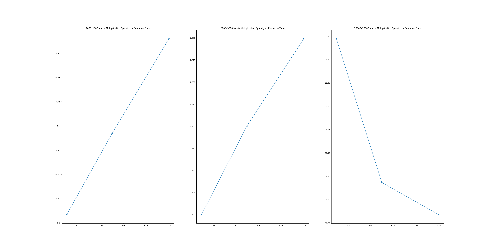
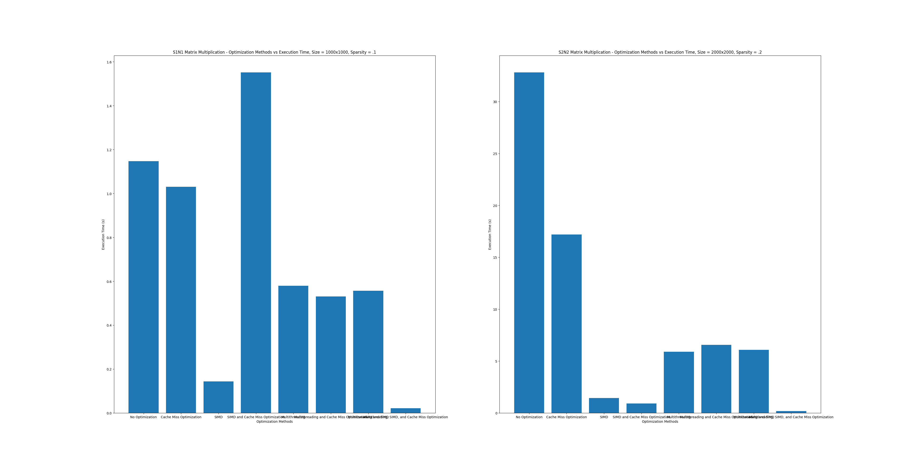
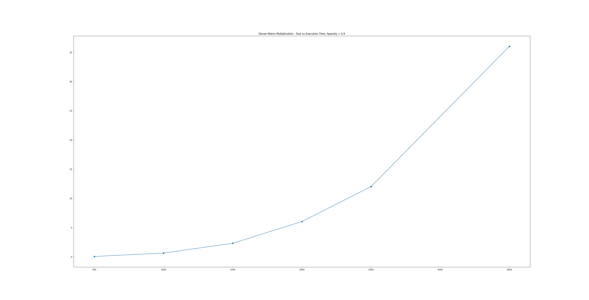
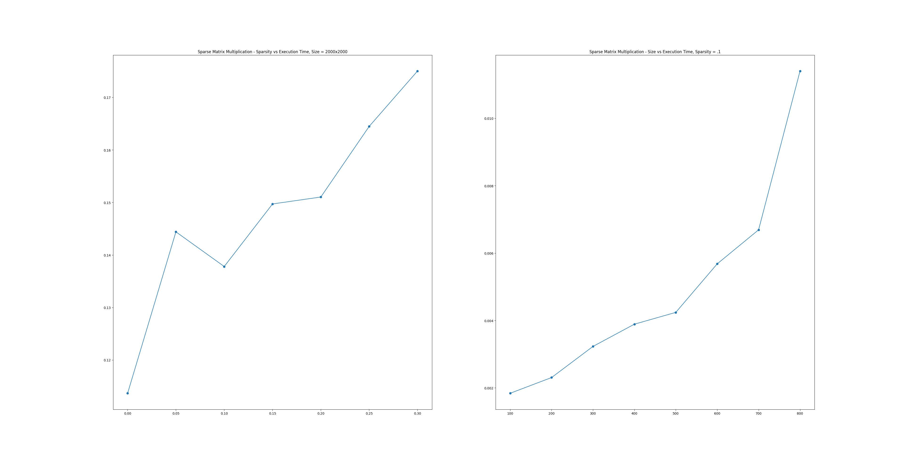
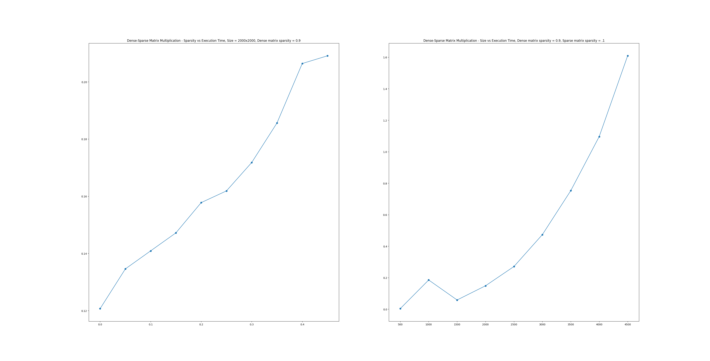

# Project 2
To compile the code use the flag: -mavx2
To run the project, execute main.o

To generate the data seen in each plot, the main function in main.c was uniquely constructed to make use of multiple infrastructural functions that allow for the generation of arbitrary matrices, the multiplication of those matrices, and the timing of the multiplication operation.

Generally, to run any test, one can follow the following steps:
1. Modify the main function in main.c to do the following:
  1. Generate two matrices a, and b (call generate_matrix and save the result in a new matrix struct)
  2. Initialize an empty matrix to contain the result of your multiplication
  3. Start a timer using clock_gettime
  3. Call a multiplication function and save the result to the result matrix (all multiplication functions follow the form multiply_matrices_xxxxx, where xxxx is one of: no_opt, multithread, simd, block)
  4. End the timer using clock_gettime
  5. Print the time elapsed in seconds using the get_time_elapsed
  6. Free all a,b, and result matrices using free_matrix function
2. Extract runtime results and plot using plots.py
See the following example code:

```c
    struct matrix matrix1 = generate_matrix(rows, cols, sparsity, print);
    struct matrix matrix2 = generate_matrix(rows, cols, sparsity, print);  // Note: cols of matrix1 must equal rows of matrix2
    struct matrix result_matrix;
    //measure the time it takes to multiply the matrices
    struct timespec start_time, end_time;

      clock_gettime(CLOCK_MONOTONIC, &start_time);  // Start time

      // Multiply the matrices with no optimization
      result_matrix = multiply_matrices_no_opt(matrix1, matrix2);

      clock_gettime(CLOCK_MONOTONIC, &end_time);  // End time

      printf("Matrix multiplication took %.12f seconds (No optimization).\n", get_elapsed_time(start_time, end_time));

      // Print the result matrix
      if (print) {
        printf("Result matrix:\n");
        print_matrix(result_matrix);
      }
      free_matrix(result_matrix);
```
```

```

## Rubric Section 1: Software Implementation
- Arbitrary matrix size is enabled, see the generate_matrix function in main.c. This function accepts two integers as parameters (rows and cols) that control the matrix size.
- Multithreading is enabled, see the function multiply_matrices_multithread
- SIMD is enabled, see the function multiply_matrices_simd
- Cache Miss minimization is enabled, see the function multiply_matrices_block
- The multiply_matrices_multithread function accepts a parameter num_threads to control how many threads are spawned

## Rubric Section 2: Experiments
- At least 9 results with varying size and sparsity
  - In the left plot, 1000x1000 matrices were multiplied with sparsity ranging from .01 to .1
  - In the middle plot, 5000x5000 matrices were multiplied with sparsity ranging from .01 to .1
  - In the right plot, 10000x10000 matrices were multiplied with sparsity ranging from .01 to .1



### Optimization Experiment
- All 8 combinations of optimization methods were applied to N1,S1 and N2,S2. The results are shown below.
  - N1,S1: 1000x1000, sparsity = .1
  - N2,S2: 2000x2000, sparsity = .2
- Overlapping on the category labels obscure some information about each configuration. If each bar is assigned a binary number starting at 0, the 0th bit corresponds to multithreading, the 1st bit corresponds to SIMD, and the 2nd bit corresponds to cache blocking.
- Clearly, SIMD is the most important optimization method
- After this, multithreading provides the most speedup
- Cache blocking provides the least speedup most likely because the run time is dominated by number of operations rather than memory latency
- Size is also definitely the most significant factor in execution time, again since matrix multiplication is O(n^3)



### Dense Dense Matrix Multiplication
- The plot shows the effect of Matrix Size on Execution Time for Dense Dense Matrix Multiplication
- Matrix sparsity is set to .9 (90% non zero elements)
- The plot nicely demonstrates the O(n^3) scaling of matrix multiplication



### Sparse Sparse Matrix Multiplication
- The left plot shows the effect of matrix sparsity on sparse matrix multiplication with a fixed size of 2000x2000
- It appears that sparsity has a roughly linear effect on execution time
- The right plot shows the effects of matrix size on sparse matrix multiplication with a fixed sparsity of .1
- Size still has an exponential effect on the execution time even on sparse matrices



### Sparse Dense Matrix Multiplication
- The plot on the left shows the effect of increasing the sparsity of matrix a (from 0 -> .45) while fixing matrix b's sparsity to .9 on the execution time of a x b where a and b are 2000x2000 matrices.
- The plot shows a roughly linear increase in execution time as the sparsity of matrix a increases
- The plot on the right shows the effect of increasing the size of matrices a and b while fixing a's sparsity to .1 and b's sparsity to .9. The matrices are swept from 500 -> 4500
- This reveals once again exponential growth in execution time as the size of the matrices increases



