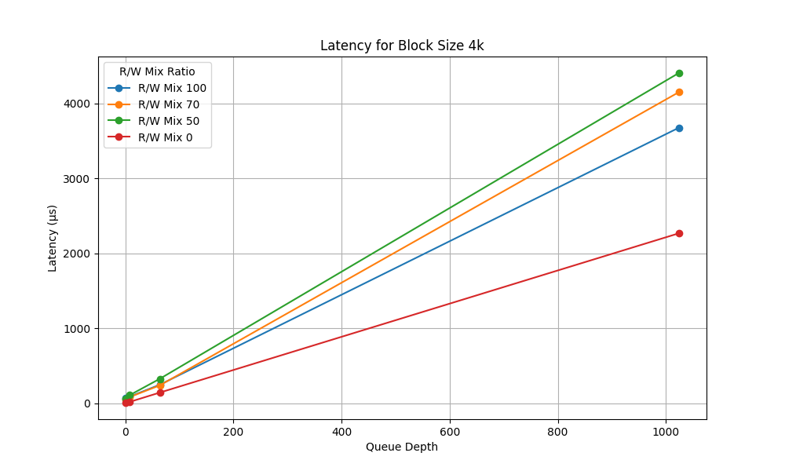
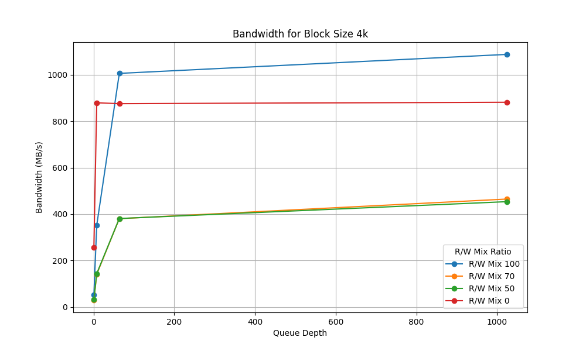
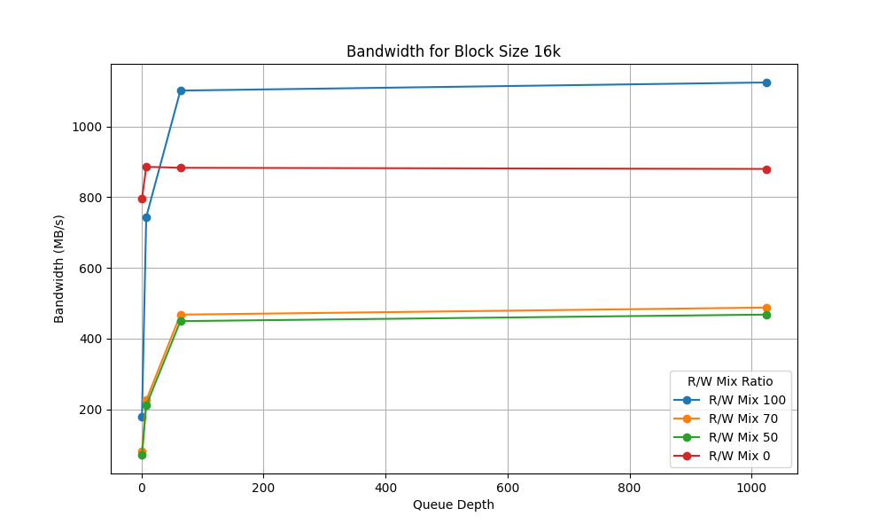
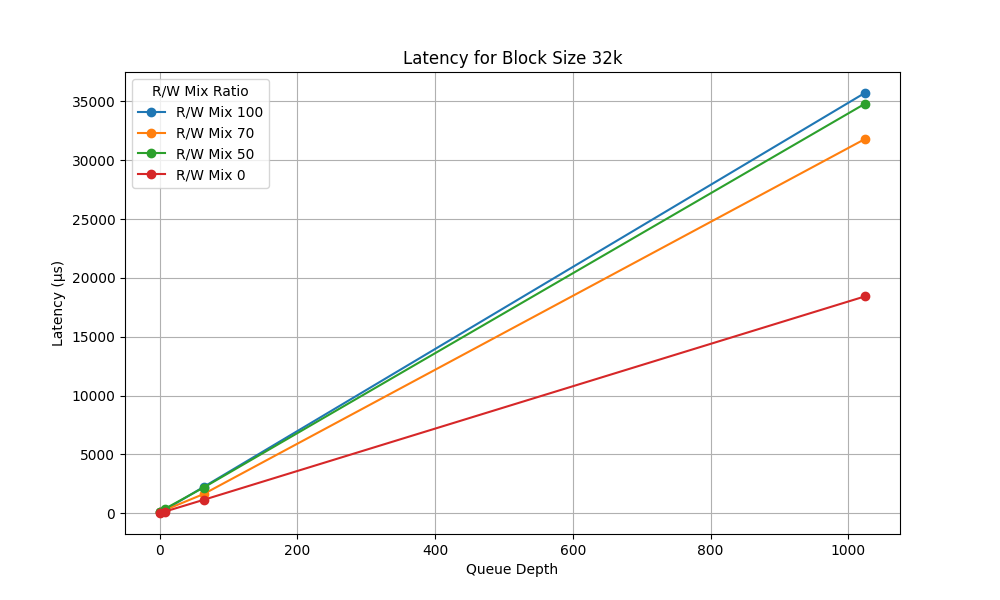
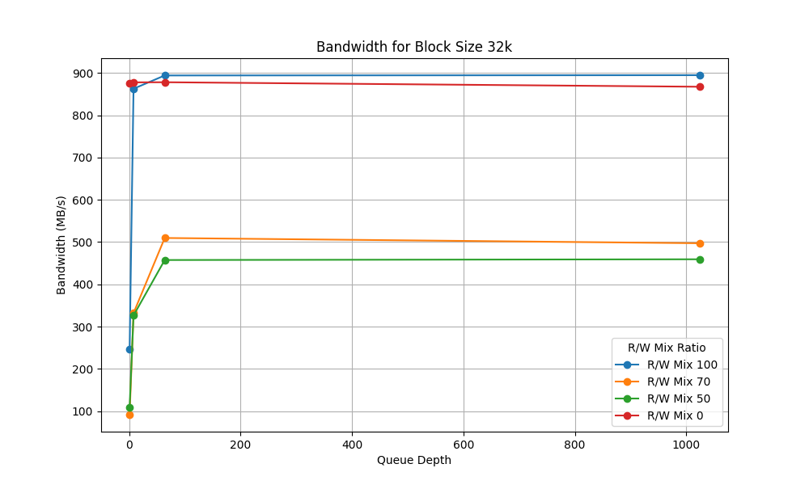

# Project 3: SSD Performance Profiling

## How it Works
1. First, a 2GB partition is created on the SSD. For my laptop, this was `/dev/nvme0n1p3`
2. Next, mount this partition using `mount -t /dev/nvme0n1p3 ./fio_partition/`
3. Once the partition is mounted, executing `./run.sh` will run the fio benchmark on the SSD
4. The results are stored in `./fio_results/` in the json format
5. These results are then parsed and plotted using `plot_fio_results.py`
6. The resulting plots are saved in `./plots/`

### FIO Options
As seen in `run_fio.sh`, the FIO tool is run according to the following (where `$name` is the name of the test, `$rw` is the read/write ratio, `$block_size` is the block size, `$queue_depth` is the queue depth, and `$result_file` is the output file):
```bash
  fio --name="$name" \
    --rw=randrw \
    --rwmixread="$rw" \
    --bs="$block_size" \
    --iodepth="$queue_depth" \
    --size=2G \
    --numjobs=1 \
    --time_based --runtime=30 \
    --ioengine=libaio --direct=1 \
    --allow_mounted_write=1 \
    --output-format=json \
    --filename=/dev/nvme0n1p3 \
    --output="$result_file"
```
As seen above, all tests are run with the "randrw" mode meaning reads and writes are not sequential (i.e. worst case performance). Each job is run for 30 seconds, using the desired combination of R/W ratio, block size, and queue depth, and the results are output in json format.

## Results
The results are two types of plots - the first being latency plots, the second being bandwidth plots. There are four variations of each type of plot, one for each block size. Each plot shows the effect of varying the queue depth on the performance of the SSD.

### 4k Block Size




We see in the plots above that as the queue depth increases, the latency drastically increases. This is expected as the SSD is being bombarded with more requests than it can handle. The bandwidth plot shows that as the SSD receives more requests, the bandwidth increases until it begins to plateau.

We also see that the bandwidth at 100% read or 100% write is higher than a mix of both.

### 16k Block Size




As we increase the block size to 16k, we see that our SSD performance follows the same trends as with 4k block size. One key difference however is that our latencies are much higher, now reaching as much as 4x the latencies of 4k block size. Our bandwidth actually increases for fully read or fully write scenarios as compared to 4k block size.

### 32k Block Size




