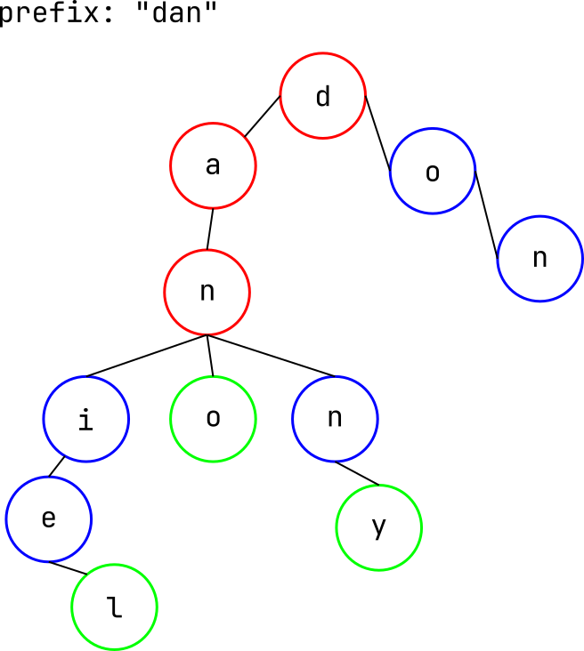

# Project 4: Encoding Column Data

## File Structure
1. `trie.c` contains the trie data structure and functions to encode and search the data.
2. `vanilla.c` contains the vanilla search functions.
3. `main.c` is the deprecated program that uses a hash table to encode the column data,
but it is unable to perform prefix search.
4. `encoding_speed_test.py` measures and plots the time it took a hash table approach to encode the column data.
5. `encoding_speed_test_trie.py` measures and plots the time it took the trie to encode the column data.
6. `helper.h` contains helper functions for the deprecated hash table approach
7. `trie.h` contains the function declarations for the trie data structure and functions.

## How it Works

1. The raw column data is ingested into a carefully selected data structure
(explained below).
2. The data is then written to a text file with the following form:

```plaintext
daniel 3 8787 28823 1226268
```

  The first entry is the key, the second entry is the number of occurrances
  of this key in the original column data, and all following entries are
  the indices at which the key can be found.

3. Once this file is created, it can be later loaded for speedy searching either
by searching for the entire key, or by searching for a prefix.

## Data Structure



*In the image above, the prefix "dan" is found during search (red nodes) and each key with the same prefix is found by traversing
through all of the prefix's children nodes*

The data structure selected to store the encoded column data is a [Trie](https://en.wikipedia.org/wiki/Trie).
Each node in the trie represents a single letter. As the column data is encoded, as an
entire key is encoded, the tree grows as each letter is processed. This means that all
keys in the data with the same prefix share the same nodes until the point at which they
diverge. This impressive storage efficiency as well as constant speed searches (both prefix and word).

## Results and Analysis
The trie data structure is incredibly efficient at storing and searching for keys. Its drawback is
that it is slow to encode the raw column data into the trie. This is because it cannot easily be parallelized without
risk of resource contention. Unfortunately, multithreading the encoding process actually led to slower raw data ingest as
the threads were constantly waiting on each other to access the trie. However, the trie is incredibly fast at searching for
both words and prefixes.


As seen in the graph above, the trie encoding time does not see a speedup as more threads are used. In fact it seems that the overhead of orchestrating
multiple threads slows down the time to encode the raw data into the trie.

This deficiency is met with nearly instantaneous search times.

With almost 200,000,000 keys in the trie, the search time for a single word is measured as 0.000000 seconds.
The time to search for all keys with a 3 letter prefix was 0.000074 seconds.


Time spent during trie search: (execution time for search_by_prefix and search_trie in trie.c)
```plaintext
Time taken to search by prefix "dan": 0.000074 seconds
Time taken to search for word "dano": 0.000000 seconds
key dano has 315 occurrances
```

Time spent during vanilla search was significantly longer: (Run time for vanilla.c)
```plaintext
Time taken to search by prefix "dan": 2.71 seconds
Time taken to search for word "dano": 2.68 seconds
```

SIMD is not implemented as no speedup is necessary with this choice of data structure. I suppose that many keys could searched for simultaneously
and that there could be a large speedup from SIMD for that workload; however, the assignment refers to search speedup during single key or single prefix searches.

One major downside of this approach is that the storage size for the raw column data isn't reduced. The encoded column file is a bit larger than
the raw column file. This is because even though there are less repeated keys, the encoded file needs to store the indices at which each key can be found.
This conversion increases the size of the file but greatly increases our ability to search through the data.

## Conclusion
The choice of the Trie data structure allowed us to search through the massive amount of column data in constant and nearly instantaneous time.
The cost of this search speed was encoding time and space efficiency. The usage of a central data structure to store the encoded column data led to
resource contention which hindered speedup from parallelization via multithreading. SIMD speedup during search was completely unnecessary since search
times were already nearly instantaneous.
